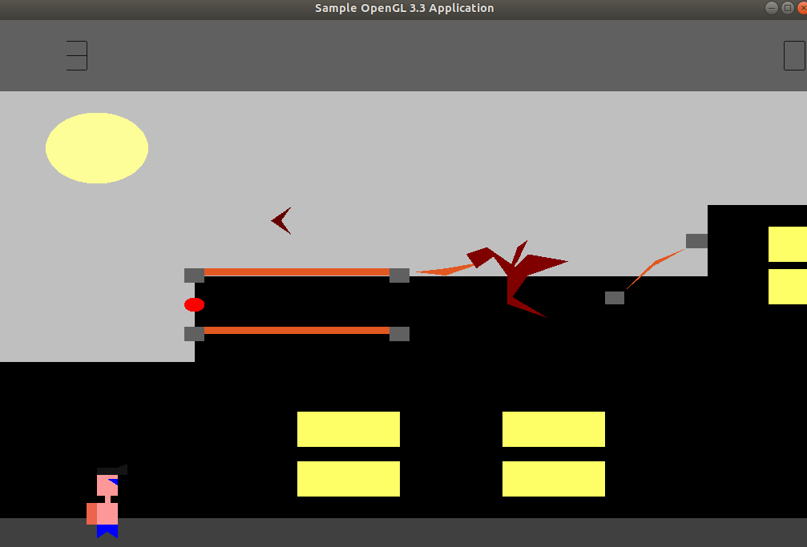

# Project Title
This will be an arcade game (inspired by ​ Jetpack Joyride​ ) where the player
controls the object (for simplicity, it can be a ball too) and move it up, forward and
backward while collecting coins. The player should also dodge the
obstacles/enemies as they have penalties.

### Prerequisites
OpenGl 3.0

## Installing
* Clone this repo to your Local machine.
* Do the following steps to run game:
   * mkdir build.
   * cd build.
   * make all.
   * ./graphics_asgn1.
 
 ## Features:
 * The world consists of a wall,7 segmented score display,platform and the player.The player
   will have a Jetpack attached to him with which he can move up.
 * Coins,Magnets(the player’s motion to be influenced).
 * Circular ring: A semi circular horizontal ring should appear after a certain
  distance, if the player goes inside this ring he should follow the semi circular
  path and will be protected from the enemies.
 * Special Flying objects:
    Green Boomerang is for getting extra life
    Pink is for shield Shield last for 10 seconds after getting it during which no enemy can harm player
 * The game  have certain enemies(on collision with them,the player should lose points:
   * Enemy 1(​ Fire Lines)
   * Enemy 2(​ Fire Beams)
   * Enemy 3(​ Brown colored Boomerangs)
   * Enemy 4(​ Viserion Dragon​ )
  
 ## Controls
  * Space -> Jump
  * S -> Throw ballons
  * Right -> Move forward
  * Left -> Move backward
  
  ## How to win the game
  Kill viserion Dragon by throwing some ballons.
  
 
 ###### Please report any bugs/issues
    
 

